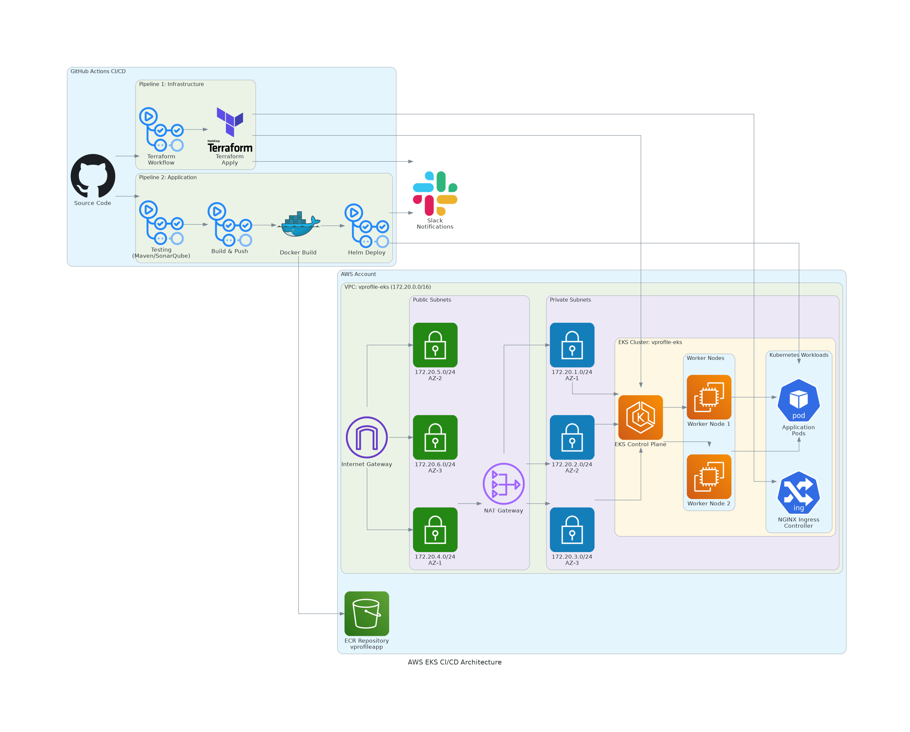

# 🌐 Vprofile Infrastructure (IaC)

This repository contains Terraform code and a GitHub Actions pipeline to provision AWS infrastructure for the Vprofile application.

---

## 🏗️ Architecture

---

## 🎥 Demo Video

Watch the complete infrastructure provisioning and automation demo below:

This video demonstrates:
- Terraform-based AWS infrastructure provisioning
- Automated EKS cluster creation
- GitHub Actions IaC pipeline execution
- NGINX Ingress Controller deployment
- End-to-end DevOps workflow in action

---

## ⚙️ Components
- **VPC**: `172.20.0.0/16`
  - 3 Public Subnets
  - 3 Private Subnets
  - Single NAT Gateway
- **EKS Cluster**: `vprofile-eks`
- **Ingress Controller**: NGINX
- **Terraform Backend**: Remote state in S3

---

## 🚀 GitHub Actions Pipeline: `Vprofile IAC`
1. Terraform init, fmt, validate, plan, apply
2. Configure AWS credentials
3. Provision VPC + EKS
4. Update kubeconfig
5. Install NGINX Ingress Controller
6. Send Slack notification

---

## 🔑 GitHub Secrets
- `AWS_ACCESS_KEY_ID`
- `AWS_SECRET_ACCESS_KEY`
- `BUCKET_TF_STATE`
- `SLACK_WEBHOOK_URL`
